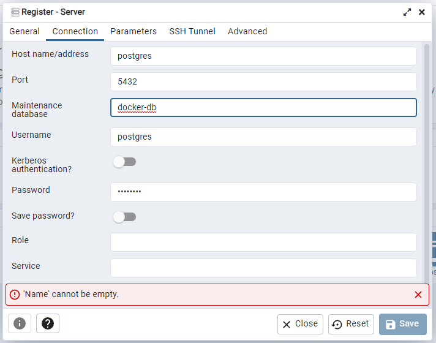

# API-DOCKER

## Comandos do docker usados

docker build -t docker-api .
build >> para buildar a imagem
-t >> para não prender nosso terminal
docker-api >> nome dado a imagem
. >> porque o Dockerfile esta na raiz do projeto

## Comandos maven

mvn package spring-boot:repackage >> usado para criar 0 .jar

## Comandos para conectar o banco no pg admim

